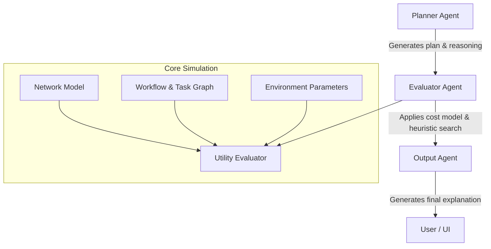

# Agentic Workflow Framework for Multi-Task Offloading

**Project:** BTP – 2201CS24 & 2201CS31

**Authors:**

- [Erum Meraj](https://github.com/erum-meraj)
- [Hrishikesh Choudhary](https://github.com/vivekananda1001)

---

## Overview

This repository presents an agentic framework for **multi-task offloading** in **edge–cloud systems**, designed to optimize computational load distribution across heterogeneous devices.
The system integrates **LLM-guided planning**, **cost-based evaluation**, and **network-aware simulation** to identify efficient task placement policies under latency–energy trade-offs.

---

## System Architecture



The overall workflow proceeds as follows:

1. **Planner Agent**: Generates an initial offloading plan and justification using an LLM.
2. **Evaluator Agent**: Performs cost-based analysis to select the optimal task placement.
3. **Output Agent**: Summarizes the decision-making process and outputs interpretable results.

---

## Repository Structure

```
agents/
 ├── main.py              # Entry point for multi-agent orchestration
 ├── base_agent.py        # LLM interface and prompt management
 ├── planner.py           # Planner agent for strategy generation
 ├── evaluator.py         # Evaluator agent for cost optimization
 ├── output.py            # Output agent for result summarization
 └── result.md

core/
 ├── workflow.py          # Workflow and task abstractions
 ├── network.py           # Network, node, and link definitions
 ├── environment.py       # Environment modeling
 ├── cost_eval.py         # Utility evaluator and cost functions
 └── utils.py             # Helper functions (e.g., topological sorting)

runner/
 └── run_graph.py         # Example runner using StateGraph

chat_interface.py         # Streamlit-based user interface
.env, requirements.txt, pyproject.toml
```

---

## Key Components

| Component                 | Description                                          |
| ------------------------- | ---------------------------------------------------- |
| `PlannerAgent`            | Generates LLM-guided offloading plans                |
| `EvaluatorAgent`          | Evaluates and selects the best task placement policy |
| `OutputAgent`             | Produces explanations of system decisions            |
| `BaseAgent`               | Base LLM wrapper for agentic reasoning               |
| `Workflow`, `Task`        | Workflow DAG and task representations                |
| `Network`, `Node`, `Link` | Physical network model                               |
| `Environment`             | Stores node and link parameters                      |
| `UtilityEvaluator`        | Evaluates delay and energy costs                     |
| `run_experiment()`        | Helper for executing example workflows               |

---

## Evaluation Concept and Methodology

The **EvaluatorAgent** determines the most cost-efficient mapping of workflow tasks to available nodes by combining **LLM-generated heuristics** with **systematic and exhaustive search**.

### 1. Objective Function

The total offloading cost is defined as:

[
U(w, p) = \delta_t \cdot T + \delta_e \cdot E
]

where:

- ( T ) — total delay (critical-path latency)
- ( E ) — total energy consumption
- ( \delta_t, \delta_e ) — weighting coefficients for delay and energy

The goal is to identify the policy ( p^\* ) minimizing ( U(w, p) ).

---

### 2. Workflow Representation

The **workflow** is modeled as a Directed Acyclic Graph (DAG) where:

- **Nodes** represent computational tasks.
- **Edges** represent data dependencies.

Each task can be assigned to one of several locations (e.g., local device, edge node, or cloud server).

---

### 3. Evaluation Procedure

The `EvaluatorAgent` follows the process below:

#### a. Environment Normalization

All environment parameters (`DE`, `VE`, `VR`, `DR`) are standardized to a consistent internal format to ensure compatibility with the evaluator.

#### b. LLM-Guided Heuristic Generation

The agent constructs a detailed prompt describing:

- Number of tasks
- Task dependencies and sizes
- Available compute locations
- Planner’s proposed reasoning

Using its `think_with_cot()` method, the LLM generates several candidate policies (e.g., `[0,1,1,0]`, `[1,0,0,1]`) representing task-to-node assignments.

#### c. Systematic and Exhaustive Search

In addition to LLM suggestions, the agent includes baseline candidates such as:

- All tasks local
- All tasks offloaded
- Alternating or clustered placements

If the total search space (( n*{locations}^{n*{tasks}} )) is below 10,000, the agent performs a full exhaustive evaluation using `itertools.product`.

#### d. Cost Computation

For each candidate placement policy, the total offloading cost is computed via:

```python
cost = self.evaluator.total_offloading_cost(workflow, placement, evaluator_params)
```

The **UtilityEvaluator** calculates both delay and energy terms using:

- Node execution capabilities (`VE`)
- Data transmission delays (`DE`, `DR`)
- Energy coefficients (`VR`)

#### e. Optimal Policy Selection

The policy with the minimum cost is chosen as the optimal configuration:

```python
{
    "evaluation": "Best policy found with total cost = ...",
    "optimal_policy": [ ... ]
}
```

This result is returned to the next agent or the user interface for explanation and visualization.

---

## Computation Model

The UtilityEvaluator computes total cost as a weighted sum of latency and energy:

[
U(w, p) = \delta_t \cdot T_{critical} + \delta_e \cdot E_{total}
]

- **Latency** ((T\_{critical})): Computed from task execution times and data transfer delays along the critical path.
- **Energy** ((E\_{total})): Derived from node energy consumption rates, transmission energy, and workload intensity.
- The coefficients (\delta_t) and (\delta_e) allow balancing between performance and energy efficiency.

---

## Quick Start

### 1. Environment Setup

```bash
python -m venv .venv
# Activate the environment (Windows: .venv\Scripts\activate)
pip install -r requirements.txt
```

### 2. API Configuration

Create a `.env` file and insert your Google API key:

```text
GOOGLE_API_KEY="YOUR_GOOGLE_API_KEY"
```

### 3. Launch Interactive Interface

```bash
streamlit run chat_interface.py
```

This launches the Streamlit-based UI for agent interaction and workflow evaluation.

### 4. Run the Workflow Programmatically

```bash
python -m agents.main
```

Running as a module ensures proper relative imports for sibling packages such as `core/`.

---

## Development Notes

- **Parameter tuning:** Adjust coefficients (`CT`, `CE`, `δ_t`, `δ_e`) in
  `EvaluatorAgent.find_best_policy()` to modify the cost function.
- **Model selection:** To change the LLM backend, update `BaseAgent.__init__()` in `agents/base_agent.py`.
- **Extensibility:** Additional network nodes, energy models, or workflow topologies can be added in the `core/` module.
